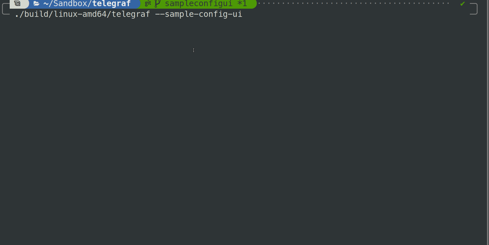

# TelegrafCompanion

A TUI for Telegraf to help generate a sample config

## Building and running tests

This project uses [Magefiles](https://magefile.org/).

Run all tests: `mage -v test`
Build for local OS: `mage build`
Build for specific OS: `mage build windows`
